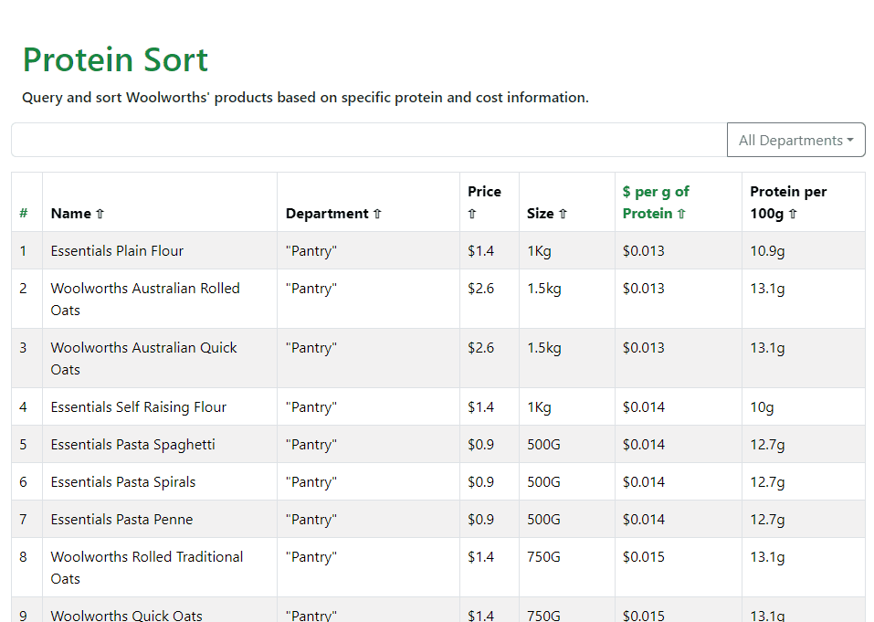

# ProteinSort

Protein sort is a webapp that uses data gathered from Woolworths' API to display and filter
granular information about product protein content.
 
Data is displayed in an infinite scroll table that can be searched and filtered by category. 
 
Intended for bodybuilders, fitness enthusiasts or anyone interested in buying high protein foods on a budget.
  
 
Front end built using React, and React-Bootstrap. Backend using Node, Express.JS, Knex. Located under `/protein-sort`
 
Data collected from Woolworths and cleaned using Python, then stored in an MySQL DB. Located under `/requests`
  

## Setup
1. Pull the repository 
2. Make sure you have a MySQL instance running. The default credentials are: 
    - host = 'localhost',
    - user = 'root',
    - password = 'password',
    - database = 'proteinsort'
3. cd into `/requests` and run `python -m pip install requests mysql-connector-python`
4. Change the user-agent used for HTTP requests in `categoryRequests.py`
5. Run the script using `python .\categoryRequests.py`. This takes ~10-15 minutes, as I've set a delay between requests to prevent getting blocked.
6. cd out and into `protein-sort` then run `npm install` to get the required packages
7. `npm start` and you should be good to go!
